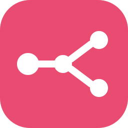

## Olá! Eu sou o João Vitor

**Desenvolvedor Back-end • Automações com IA & APIs**

Transformo conversas em automações inteligentes. Meu foco é elevar o nível das
integrações de WhatsApp: uso Python para orquestrar APIs e modelos de IA, criando
soluções mais robustas e flexíveis do que as plataformas de automação convencionais.

Atualmente sou **CTO na Uv Informática** e **Partner na BotConversa**, onde construo
atendimentos que rodam 24h — arquitetura determinística com fallback para IA, n8n e
Chatwoot na orquestração, serviço próprio de WhatsApp em Node.js e dashboard de
operação em tempo real.

 

