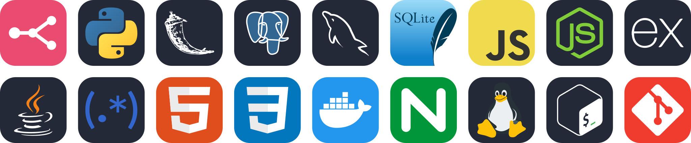

## Olá! Eu sou o João Vitor

**Desenvolvedor Back-end • Automações com IA & APIs**

CTO na **Uv Informática** e Partner na **BotConversa**. Transformo conversas em
automações inteligentes: uso Python para orquestrar APIs e modelos de IA, criando
soluções mais robustas e flexíveis do que as plataformas de automação convencionais.

---

### O que eu construo

Automações de atendimento em WhatsApp que rodam 24h, sem menu numerado. O cliente
escreve como falaria com uma pessoa — várias linhas, abreviação, erro de digitação —
e o fluxo entende, registra e responde.

- **Determinístico primeiro** — normalização, fuzzy match e regras resolvem a maior
  parte das mensagens sem gastar token nem esperar modelo responder.
- **IA quando compensa** — o que foge do padrão vai para modelo de linguagem, local ou
  em nuvem, escolhido conforme o custo e a latência que o caso aceita.
- **Infra própria** — serviço de WhatsApp self-hosted em Node.js com Baileys (sessões,
  pareamento, reconexão), alternativa às plataformas que cobram por mensagem; produção
  crítica segue na API oficial da Meta.
- **Handoff para humano** — quando o bot não deve decidir, a conversa passa para o
  atendente no Chatwoot com o histórico inteiro junto.
- **Operação visível** — dashboards em tempo real para acompanhar fila, status e
  intervir na mão quando precisa.

---

### Stack

---

### Onde cada uma entra

| Ferramenta | Uso no dia a dia |
| --- | --- |
| **Python + Flask** | APIs REST, regras de negócio, webhooks e autenticação |
| **PostgreSQL** | Clientes, sessões de conversa e dados transacionais |
| **Node.js + Express** | Serviço de WhatsApp com Baileys — pareamento, sessões e reconexão |
| **WhatsApp Cloud API** | Canal oficial da Meta no fluxo de produção — número verificado e entrega garantida |
| **n8n** | Orquestração dos fluxos de atendimento entre WhatsApp, API e IA |
| **Claude + Ollama** | Interpretação de linguagem natural — nuvem quando o caso pede qualidade, local quando pede custo zero |
| **Chatwoot** | Painel dos atendentes humanos, com tema próprio escrito em CSS |
| **Docker** | Containers do Chatwoot na VPS — operação, logs e troubleshooting |
| **Nginx** | Proxy reverso e injeção do tema customizado via `sub_filter` |
| **Linux + Bash** | VPS Ubuntu, serviços `systemd`, deploy por SSH e rollback |
| **Regex** | Parser determinístico — normalização, sinônimos e tolerância a erro de digitação |
| **Java** | Base de orientação a objetos e estruturas de dados |
